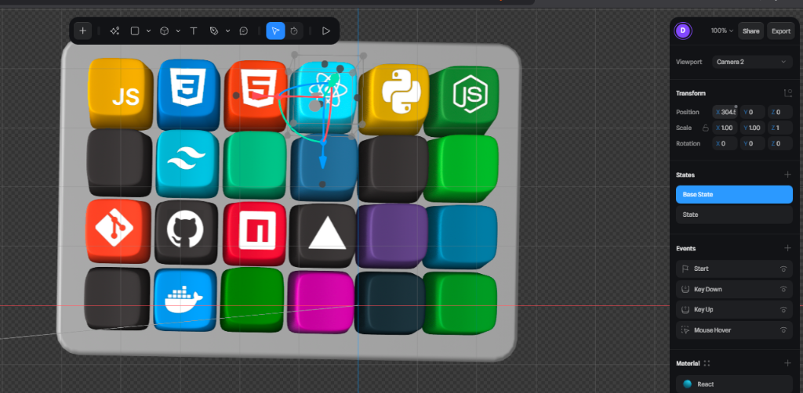

# Dimas Tri Mulyo - Portfolio Website

<div align="center">
  
  
  [](https://dimasu.site)
  [](https://github.com/dimasu21)
</div>

---

## Features

- **Multi-language Support**: English & Indonesian support using i18next.
- **3D Interactive Elements**: Integrated Spline 3D models with interactive keyboard and scene controls.
- **Blog System**: Full capability CMS powered by Supabase with pagination, likes, and reading time estimation.
- **Guestbook**: Real-time comment system with Google & GitHub authentication.
- **Modern UI/UX**: Built with React 18, utilizing Framer Motion for smooth animations and Lenis for inertia scrolling.
- **SEO Optimized**: dynamic sitemap generation, JSON-LD structured data, and meta tag management.
- **Fully Responsive**: Optimized mobile experience with custom 3D model loaders and touch interactions.
- **Dark & Light Mode**: Seamless theme switching with persistent state.

---

## Tech Stack

| Category           | Technologies                       |
| ------------------ | ---------------------------------- |
| **Frontend**       | React 18, Vite 7                   |
| **3D & Animation** | Spline, GSAP, Framer Motion        |
| **Styling**        | Tailwind CSS, PostCSS              |
| **Backend**        | Supabase (Auth, Database, Storage) |
| **Deployment**     | Vercel                             |
| **SEO**            | react-helmet-async, JSON-LD        |

---

## Project Structure

```
src/
├── assets/          # Images, sounds, and 3D models
├── components/      # Reusable UI components
├── context/         # Global state (Theme, Auth)
├── hooks/           # Custom React hooks
├── i18n/            # Internationalization (en.json, id.json)
├── lib/             # Supabase client, utility functions
└── pages/           # Application routes
    ├── AboutMe/     # 3D Profile scene
    ├── Blog/        # Blog list & content
    ├── Guestbook/   # Interactive chat feature
    ├── Hero/        # Landing page
    ├── Projects/    # Portfolio showcase
    └── Skills/      # Interactive 3D keyboard
```

---

## Getting Started

### Prerequisites

- Node.js 18+
- npm or yarn

### Installation

```bash
# Clone the repository
git clone https://github.com/DimasTriM/modern-portfolio.git
cd modern-portfolio

# Install dependencies
npm install

# Start development server
npm run dev
```

Open [http://localhost:5173](http://localhost:5173) to view it.

### Build for Production

```bash
npm run build
```

This will run the sitemap generator and build the Vite project.

---

## Environment Setup

Create a `.env` file in the root directory and configure your Supabase credentials:

```env
VITE_SUPABASE_URL=your_supabase_url
VITE_SUPABASE_ANON_KEY=your_supabase_anon_key
```

Required Supabase tables:

- `blog_posts`: Stores blog content and metadata.
- `blog_likes`: Tracks user likes on posts.
- `guestbook`: Stores public messages and comments.
- `admins`: Whitelist for admin access.

---

## License

This project is licensed under **CC BY-NC-SA 4.0**.
You may share and adapt with attribution, non-commercially.
