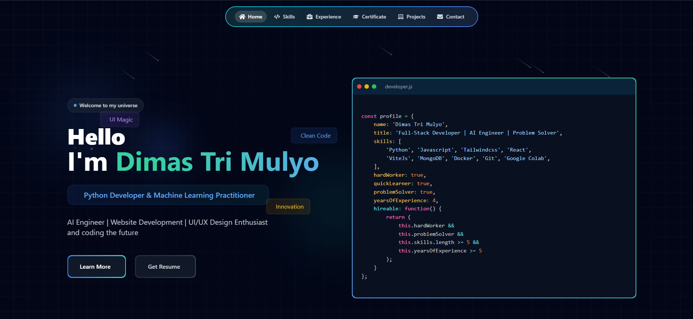

# Portfolio Website

<div align="center">
  <pre>
    _____           _    __      _ _       
   |  __ \         | |  / _|    | (_)      
   | |__) |__  _ __| |_| |_ ___ | |_  ___  
   |  ___/ _ \| '__| __|  _/ _ \| | |/ _ \ 
   | |  | (_) | |  | |_| || (_) | | | (_) |
   |_|   \___/|_|   \__|_| \___/|_|_|\___/ 
  </pre>
</div>

Welcome to my **portfolio website**! This site showcases my skills, experience, Certificate, projects, and how to get in touch with me. It's built with **React** and **Vite** for a fast, modern web experience. You can explore my work, learn about my journey, and contact me directly.

---

## Demo



---

## Live Preview

Check out the live preview of the portfolio website here:  
[**Live Demo**](https://codervai.vercel.app/)

---

### 🎯 Project Structure

```bash
portfolio/
├── node_modules/
├── public/
├── src/
│   ├── assets/
│   │   ├── css/
│   │   │   ├── index.css
│   │   │   └── tomorrow.css
│   │   └── images/
│   ├── components/
│   │   ├── ui/
│   │   │   ├── Reusable Components/
│   │   │   │   ├── badge.jsx
│   │   │   │   ├── button.jsx
│   │   │   │   ├── card.jsx
│   │   │   │   ├── CertificateLoader.jsx
│   │   │   │   ├── evervault-card.jsx
│   │   │   │   ├── flip-words.jsx
│   │   │   │   ├── icon-cloud.jsx
│   │   │   │   ├── meteors.jsx
│   │   │   │   ├── sparkles-text.jsx
│   │   │   │   └── tooltip.jsx
│   │   │   │
│   │   │   ├── Main Components/
│   │   │   │   ├── AnimatedGrid.jsx
│   │   │   │   ├── Contact.jsx
│   │   │   │   ├── Certificate.jsx
│   │   │   │   ├── enhanced-portfolio-card.jsx
│   │   │   │   ├── Experience.jsx
│   │   │   │   ├── global.jsx
│   │   │   │   ├── Header.jsx
│   │   │   │   ├── Hero.jsx
│   │   │   │   ├── Home.jsx
│   │   │   │   ├── PortfolioPage.jsx
│   │   │   │   ├── Projects.jsx
│   │   │   │   └── Skills.jsx
│   │   └── lib/
│   │       └── utils.js
│   ├── pages/
│   │   ├── About/
│   │   │   └── About.jsx
│   │   ├── Contact/
│   │   │   └── Contact.jsx
│   │   ├── Experience/
│   │   │   └── Experience.jsx
│   │   ├── Header/
│   │   │   └── Header.jsx
│   │   ├── Hero/
│   │   │   └── Hero.jsx
│   │   ├── Projects/
│   │   │   ├── Projects.jsx
│   │   │   └── testProjects.jsx
│   │   └── Skills/
│   │       └── Skills.jsx
│   ├── App.jsx
│   └── main.jsx
├── Configuration Files/
│   ├── .eslintrc.js
│   ├── .gitignore
│   ├── components.json
│   ├── index.html
│   ├── jsconfig.json
│   ├── package-lock.json
│   ├── package.json
│   ├── postcss.config.js
│   ├── README.md
│   ├── tailwind.config.js
│   ├── vercel.json
│   └── vite.config.js

```

---

## Sections of the Portfolio

The portfolio website consists of the following sections:

- **Home**: Introduction and a brief overview.
- **Skills**: A detailed list of my technical skills.
- **Experience**: My professional journey and work experience.
- **Certificate**: Academic background and certifications.
- **Projects**: A showcase of the projects I've worked on.
- **Contact**: Information on how to reach out to me.

---

## 💻 Technologies Used

- **Frontend:** React.js with Vite
- **Styling:** Tailwind CSS
- **Animations:** Framer Motion
- **Icons:** React Icons
- **Deployment:** Vercel

---

## Installation ⬇️

You will need to download **Git** and **Node** to run this project.

### Git

- Download and install Git from the official website: [Git Downloads](https://git-scm.com/)
- Verify the installation:
  ```bash
  git --version
  ```

### Node

- Download and install Node.js from the official website: [Node.js Downloads](https://nodejs.org/)
- Make sure you have the latest version of both Git and Node on your computer.
- Verify the installation:
  ```bash
  node --version
  ```

# Getting Started 🎯

Follow these steps to run the project locally on your machine.

### 1. Clone the Repository
Open your terminal and run the following command to clone the repo:

git clone [https://github.com/DimasTriM/portfolio-main.git](https://github.com/DimasTriM/portfolio-main.git)


```bash
cd portfolio-main

```

Install Dependencies ⚙️
From the root directory of your project, install the necessary packages:

```bash
npm install
```

Run the Development Server 🚀
Start the development server to see your project live:

```bash
npm run dev
```

View the Project 🌐
Open your browser and visit http://localhost:5173/ to see the result! 🎉

## 📝 License

This project is licensed under the MIT License - see the LICENSE file for details.

---

<div align="center"> Made with ❤️ by Dimas Tri Mulyo </div>
